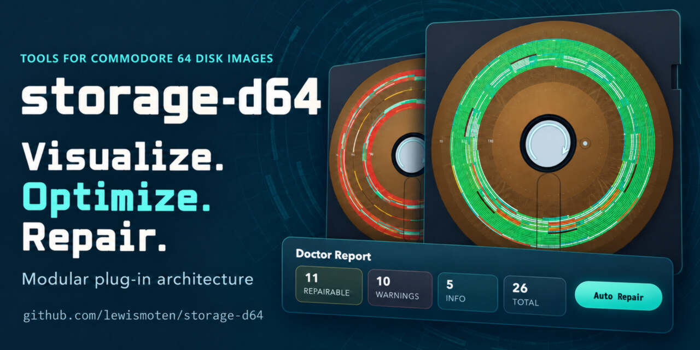

# storage-d64



**storage-d64** is a browser-native toolkit for creating, inspecting, editing,
repairing, and optimizing `.d64` disk images. It pairs a reusable JavaScript
support layer with an interactive visual lab that makes disk structure and
read-layout tradeoffs tangible.

Try it now: **[lewismoten.github.io/storage-d64](https://lewismoten.github.io/storage-d64/)**

## Why it exists

This project began as a response to disk images generated with AI assistance
that could pass basic validation yet fail to load in emulators. Diagnosing
those failures called for more than a pass/fail result: it required a way to
see the disk's architecture, follow directory and file-sector chains, and
connect suspicious bytes to the structures they affect.

That investigation grew from validation into a visualizer and repair workbench.
It now looks for the structural problems encountered in real generated images,
offers review and targeted repair paths, and provides Auto Repair where a
low-risk correction is clear. The lab also makes routine transfer easier: drop
files onto an image and download individual files directly to your filesystem.

Once image integrity was covered, the focus expanded to how placement affects
reading. The lab accounts for starting head position, disk speed, sector
placement, and chained-file access to estimate a read score. Its heat map,
Optimize, and Deoptimize controls make those tradeoffs visible and testable.

## Highlights

- Create, load, inspect, and download 35-, 40-, and 42-track images, with
  optional per-sector error information.
- Browse a visual disk map with sector details, usage data, file types,
  pan/zoom controls, a cover view, and a read-efficiency overlay.
- Manage files and metadata: import by drag and drop, export individual files,
  rename, reorder, lock, open/close, delete, restore, and repair entries.
- Inspect and edit headers, directory records, allocation data, sectors, file
  payloads, and byte ranges through structured, hex, printable-text, and
  bitmask views.
- Diagnose structural problems with Doctor, then review or apply targeted,
  low-risk repairs.
- Compare fragmented and optimized layouts to understand their estimated
  emulator read performance.
- Accept a D64 sent by another browser window for immediate inspection.

## Use the lab

The hosted lab is ready to use in a browser. To run the same static site
locally, use Node.js 18 or later:

```bash
npm install
npm run lab
```

Open <http://localhost:1541/>. The project has no build step.

## Inspect a D64 from another site

Any page can open the hosted lab and send it a disk image. The opener opens the
lab with a unique `#receive=<request-id>` fragment, waits for the
`storage-d64:ready` message, then sends this message back to the lab:

```js
{
  type: "storage-d64:load",
  sourceName: "example.d64",
  bytes: new Uint8Array(/* D64 bytes */),
}
```

`bytes` can be a `Uint8Array`, an `ArrayBuffer`, any other typed array or
`DataView`, or a plain array of integers from `0` to `255`. Sending bytes lets a
page inspect a disk it generated or a file the visitor picked, without hosting
the image at a URL. The lab's "Link a website to this D64 inspector" button
generates a copy-and-paste loader for either a URL or bytes.

The lab loads the received bytes through the same inspection path used for a
locally selected image.

## Use the plug-in

Load `plugin.js` after a compatible host has initialized `window.TPP`:

```html
<script src="https://example.com/storage-d64/plugin.js"></script>
```

It registers the `d64` storage medium and delegates export work to the host's
`window.TPP.exportImagesD64Core(options)` implementation. The reusable disk
helpers are loaded from `support.js` as `window.TPP.d64`.

`TPP` refers to the Tiny Pockets Press API. Tiny Pockets Press began as a
layout tool for printing double-sided pages that could be cut into small
leaflets, sewn into signatures, and bound into tiny books—originally with a
one-inch-square format in mind. It grew into a broader creative toolset,
including an e-reader whose content can be loaded from D64 images in an
emulator. This storage module provides the disk-image side of that workflow
while keeping its low-level helpers useful on their own.

## Documentation

The hosted demo includes an [interactive documentation viewer](https://lewismoten.github.io/storage-d64/visual-tour.html) that renders these Markdown files directly.
It uses the repository's own lightweight renderer, so the deployed viewer has
no third-party runtime dependency.

- [Visual tour](./docs/visual-tour.md) — screenshots of the lab's major workflows.
- [Lab guide](./docs/lab.md) — controls, editing surfaces, and workflows.
- [Doctor guide](./docs/doctor.md) — diagnosis, repair policy, and limitations.
- [Support API](./docs/api.md) — the `window.TPP.d64` reference.
- [Development notes](./docs/development.md) — architecture and contribution guidance.

## Acknowledgments

Created and maintained by Lewis Moten. Development was assisted by ChatGPT
Codex across GPT-5.4 through GPT-6.1.
