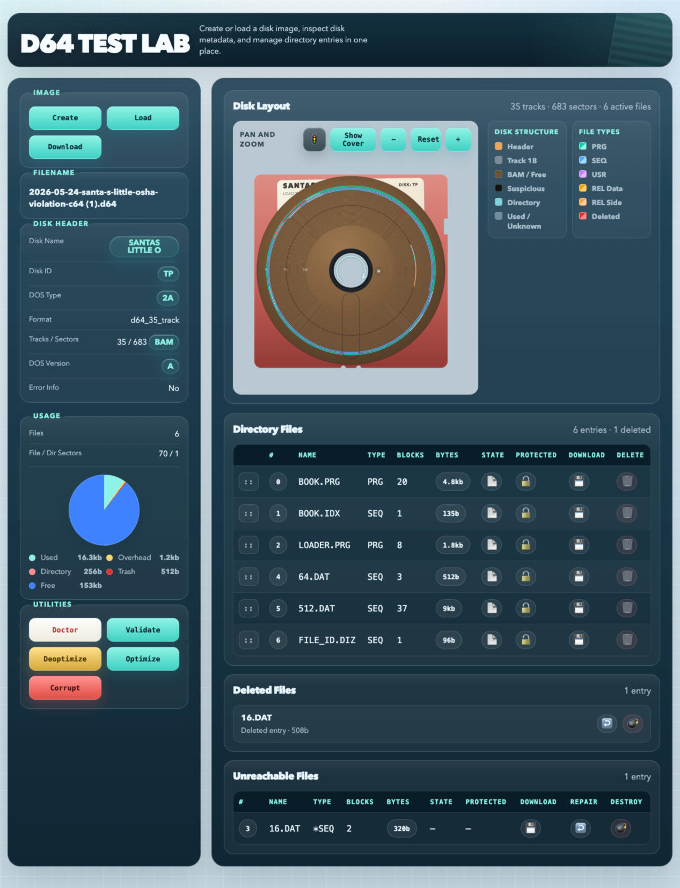
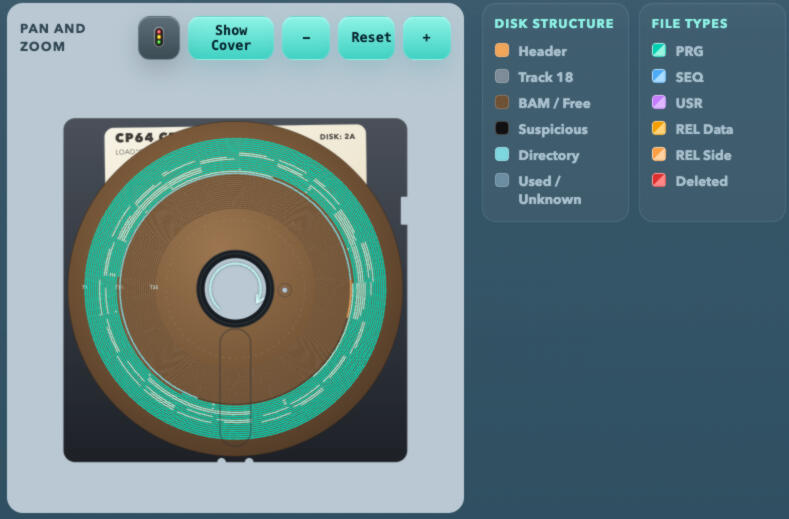
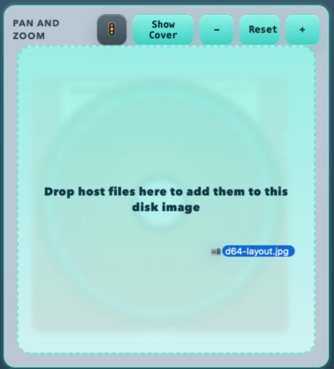
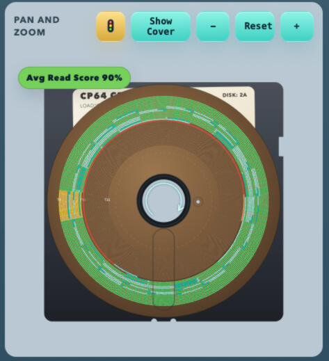
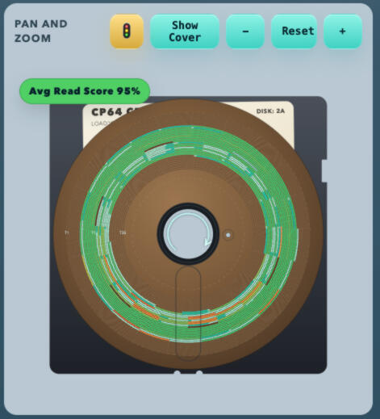
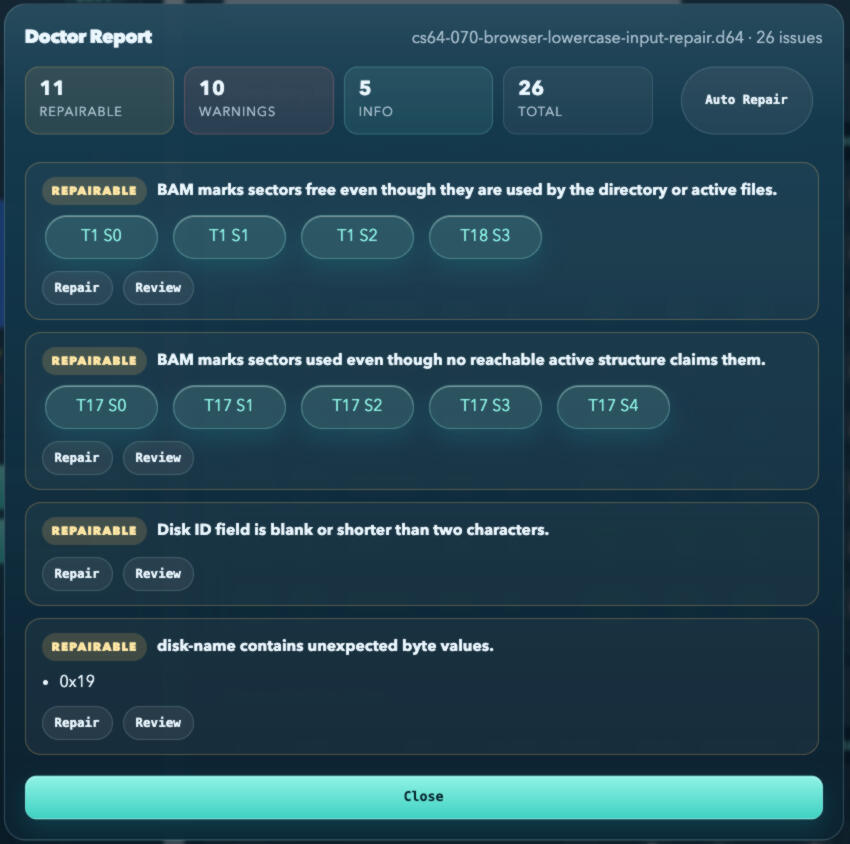
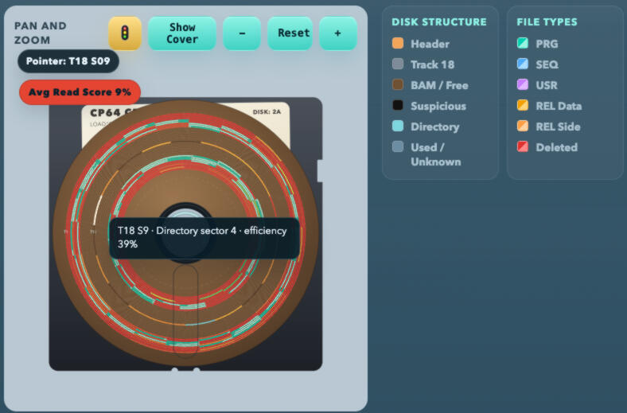

# Visual tour

[Project home](../README.md) · [Lab guide](./lab.md) · [Doctor guide](./doctor.md) · [Support API](./api.md) · [Development notes](./development.md)

The browser lab turns an opaque disk image into something you can inspect,
edit, and reason about visually. It grew beyond simple validation after
AI-generated images repeatedly exposed problems that prevented emulators from
loading them. The visualizer makes it possible to connect those symptoms to
disk structures, sector chains, and individual bytes; Doctor then offers
review, targeted repair, and low-risk Auto Repair when possible.

This tour introduces every supplied visual asset and points to the detailed
guides for the underlying workflows.

## The workspace

Create a blank image or load one from your computer. The sidebar summarizes
the header and space usage; the workspace displays the disk layout, reachable
files, deleted files, and recoverable-but-unreachable records. From here you
can download the complete image, validate its structure, introduce sample
damage for exploration, or choose an optimized or deliberately fragmented
rebuild. See the [Lab guide](./lab.md) for each control.

## Layout and sectors

The disk map groups data by track and sector. Pan, zoom, select a sector, and
use the legends to distinguish headers, allocation and directory space,
ordinary files, relative-file data and side sectors, deleted entries, and
suspicious or unclaimed data. The selected-sector inspector exposes logical
metadata, an inferred physical-sector model, and a bitplane view.

The sector icon is the compact visual cue used for this disk-oriented view.

## Import, inspect, and edit

Drop host files onto the layout to add them to the current image. Directory
rows can also be reordered. Use the directory and metadata dialogs for safer
structured changes, or use the hex and printable editors for precise byte and
range edits. Individual file payloads can be downloaded directly to your file
system from their rows.

## Measure and improve read layout

The speed-map overlay has two views. **Stock LOAD** colors each file link by
the delay it adds to a stock C64 `LOAD`; because the 1541 reads the next block
while it sends the current one, only long head jumps slow it down. **DOS
layout** colors links by how closely they follow the placement the 1541 DOS
itself uses: interleave 10, filling outward from track 18. See
[Drive timing](./drive-timing.md) for the model and its sources.

Use **Optimize** to rebuild files the way the 1541 DOS lays them out, or use
**Deoptimize** to intentionally scatter sectors for comparison and testing.
These values are explanatory estimates derived from the logical image layout;
they are not preserved physical timing measurements. More detail is in the
[Lab guide](./lab.md).

## Diagnose before repairing

Doctor begins read-only. Its report groups information, warnings, and
repairable conditions, highlights affected sectors, and offers review or
targeted repair actions. Auto Repair is reserved for changes deemed low risk;
ambiguous or potentially destructive choices remain explicit. Read the
[Doctor guide](./doctor.md) before repairing unusual images.

The **Corrupt** action creates a sample fault scenario so you can explore the
diagnostic and repair interfaces without risking a valued image. It pairs well
with Deoptimize and the speed map when demonstrating how structure and layout
affect the lab's analysis.
